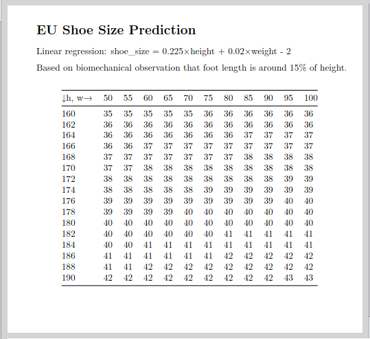

# Generic Table Generator

A Python tool for generating markdown lookup tables from AI/ML functions with 2-3 input variables. Supports both Python functions and Dart function file parsing.

Also a script to convert the markdown to PDF is provided.

<div style="text-align: center;">
  
  <p><strong>Example 2:</strong> Page from a PDF showing a table generated with this tool.</p>
</div>

## Features

- Generate markdown tables from any mathematical or ML function
- Support for 2D (single table) and 3D (multiple table pages) functions
- Parse Dart function files or use Python lambda/def functions
- Configurable input ranges with custom names and increments
- Custom explanatory notes from text or markdown files
- Robust error handling and validation

## Installation

### Requirements

- Python 3.6 or higher
- No external dependencies required

### Setup

1. Clone or download the script:
```bash
wget https://raw.githubusercontent.com/your-repo/AIaaLT.py
# or
git clone https://github.com/your-repo/table-generator.git
cd table-generator
```

2. Make the script executable (optional):
```bash
chmod +x AIaaLT.py
```

## Usage

### Basic Syntax

```bash
python AIaaLT.py --function FUNCTION --ranges RANGE1 [RANGE2 RANGE3] --title TITLE [OPTIONS]
```

### Arguments

- `--function, -f`: Function definition (Python lambda/def) or path to Dart file
- `--ranges, -r`: Input ranges in format `"name:start:stop:step"` (2-3 ranges required)
- `--title, -t`: Title for the generated tables
- `--output-dir, -o`: Output directory (default: `output_tables`)
- `--notes, -n`: Explanatory notes (multiline string or path to .md file)

### Range Format

Each range must follow the format: `"name:start:stop:step"`
- `name`: Variable name for display in tables
- `start`: Starting value (inclusive)
- `stop`: Ending value (inclusive)
- `step`: Increment between values

## Examples

### Example 1: Simple 2D Multiplication Table

```bash
python AIaaLT.py \
  --function "lambda args: args[0] * args[1]" \
  --ranges "x:1:10:1" "y:1:5:1" \
  --title "Multiplication Table" \
  --output-dir "multiply_tables"
```

This generates a single table file with x-values 1-10 and y-values 1-5.

### Example 2: Linear Regression - Weight to Shoe Size

```bash
python AIaaLT.py \
  --function "lambda args: round(0.3 * args[0] + 0.1 * args[1] + 25, 1)" \
  --ranges "weight:50:100:10:kg" "height:150:200:10:cm" \
  --title "Shoe Size Prediction (EU)" \
  --notes "Linear regression: shoe_size = 0.3×weight + 0.1×height + 25
Typical European shoe size prediction based on weight and height." \
  --output-dir "shoe_size_prediction"
```

This generates a table showing predicted EU shoe sizes based on weight and height using a simple linear model. Used as an example here because linear regression is one of the simplest and most fundamental ML models.

### Example 3: Original Use Case (Hartia B Calculation)

Create a notes file first:
```bash
cat > hartia_notes.md << 'EOF'
## *Harteikkuuden* ja *uuman* laskentatapa

- *paino* = paino kilogrammoissa (pyöristettynä)
- *h* = *harteikkuus* = `2 * hartiat - (vyötärö + lantio)`
- *u* = *uuma* = `(hartiat + lantio) - 2 * vyötärö`

Kaikki ympärysmitat (*hartiat*, *vyötärö*, *lantio*) ovat senttimetreissä
EOF
```

Then run:
```bash
python AIaaLT.py \
  --function "../flutter_app/lib/B_ml_model.dart" \
  --ranges "paino:50:150:5" "harteikkuus:-24:70:4" "uuma:-28:76:4" \
  --title "Hartiavyöhykekovuus" \
  --notes "hartia_notes.md" \
  --output-dir "hartia_B_tables"
```

## Function Input Formats

### Python Lambda Functions
```bash
--function "lambda args: args[0] + args[1]"
--function "lambda args: args[0]**2 if args[1] > 0 else 0"
```

### Python Function Definitions
```bash
--function "def my_func(args):
    x, y = args[0], args[1]
    return x * y + 10"
```

### Dart Function Files
The script can parse Dart function files that follow this pattern:
```dart
double calculateValue(List<double> input) {
  return input[0] * 2.5 + input[1] - input[2] * 0.3;
}
```

Just specify the file path containing function with the pattern of previous example:
```bash
--function "path/to/function.dart"
```

## Output Format

### 2D Functions (2 ranges)
Generates a single `{first_range_name}2{second_range_name}.md` file with a grid layout.

### 3D Functions (3 ranges)
Generates multiple files named `{first_range_name}_{value}.md`, each containing a 2D table for that fixed first dimension value.

## License

This project is released under the MIT License.
